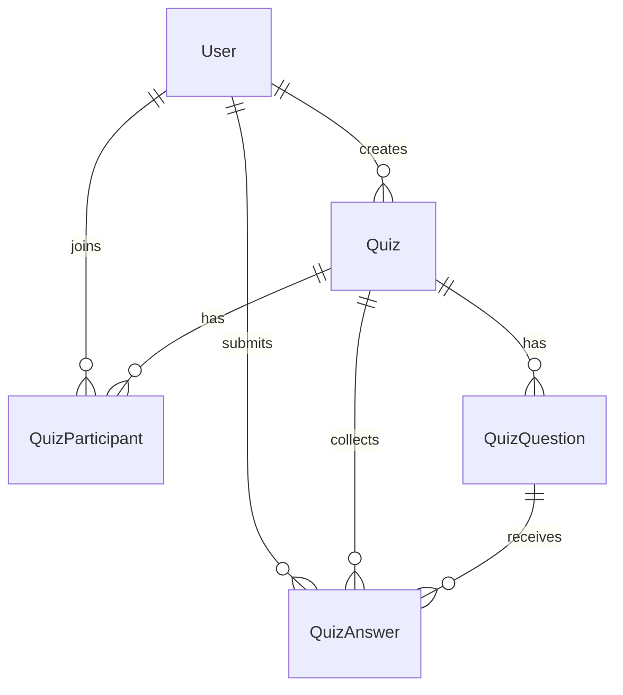
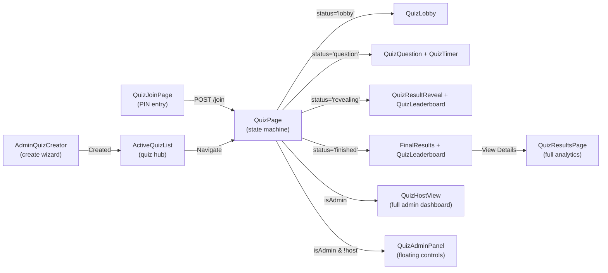
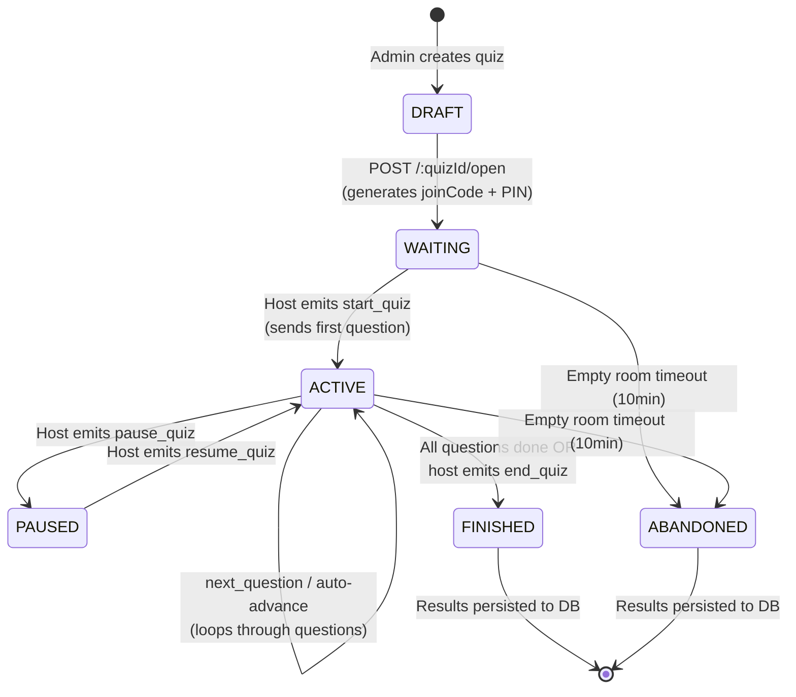

# 🧠 Live Quiz System — Complete Technical Documentation

> **Last updated:** 2026-03-07  
> A real-time, Kahoot-style live quiz engine built into the code.scriet club website.

---

## Table of Contents

1. [Architecture Overview](#architecture-overview)
2. [Tech Stack](#tech-stack)
3. [Database Schema](#database-schema)
4. [Backend — In-Memory Store](#backend--in-memory-store)
5. [Backend — REST API](#backend--rest-api)
6. [Backend — Socket.io Real-Time Layer](#backend--socketio-real-time-layer)
7. [Frontend — State Management](#frontend--state-management)
8. [Frontend — Pages & Components](#frontend--pages--components)
9. [Scoring Algorithm](#scoring-algorithm)
10. [Security & Anti-Cheat](#security--anti-cheat)
11. [Quiz Lifecycle](#quiz-lifecycle)
12. [File Map](#file-map)

---

## Architecture Overview

```
┌─────────────────────────────────────────────────────────┐
│                     FRONTEND (React/Vite)               │
│                                                         │
│  ┌──────────────┐  ┌──────────────┐  ┌──────────────┐  │
│  │ QuizJoinPage │  │   QuizPage   │  │QuizResultsPage│ │
│  │  (PIN entry) │  │ (state machine│ │ (analytics)   │  │
│  └──────┬───────┘  │  + game UI)  │  └──────┬───────┘  │
│         │          └───────┬──────┘         │           │
│         │                  │                │           │
│  ┌──────▼──────────────────▼────────────────▼───────┐   │
│  │    Zustand Store (quizStore.ts)                   │   │
│  │    — single source of truth for ALL quiz state    │   │
│  └──────────────────────┬───────────────────────────┘   │
│                         │                               │
│  ┌──────────────────────▼───────────────────────────┐   │
│  │    useQuizSocket (hook)                           │   │
│  │    — bridges Socket.io events ↔ Zustand actions   │   │
│  └──────────────────────┬───────────────────────────┘   │
│                         │                               │
└─────────────────────────┼───────────────────────────────┘
                          │  WebSocket (Socket.io /quiz namespace)
                          │  + REST API (HTTP)
┌─────────────────────────┼───────────────────────────────┐
│                     BACKEND (Express + Socket.io)        │
│                         │                               │
│  ┌──────────────────────▼───────────────────────────┐   │
│  │    quizSocket.ts                                  │   │
│  │    — all real-time event handlers                 │   │
│  └──────────────────────┬───────────────────────────┘   │
│                         │                               │
│  ┌──────────────────────▼───────────────────────────┐   │
│  │    quizStore.ts (IN-MEMORY)                       │   │
│  │    — zero DB during active quiz                   │   │
│  │    — all state lives in a Map<string, QuizRoom>   │   │
│  └──────────────────────┬───────────────────────────┘   │
│                         │                               │
│  ┌──────────────────────▼───────────────────────────┐   │
│  │    quizRouter.ts (REST)                           │   │
│  │    — CRUD, join, results, Excel export            │   │
│  └──────────────────────┬───────────────────────────┘   │
│                         │                               │
│  ┌──────────────────────▼───────────────────────────┐   │
│  │    PostgreSQL via Prisma ORM                      │   │
│  │    — persisted only at quiz load + quiz end       │   │
│  └──────────────────────────────────────────────────┘   │
└─────────────────────────────────────────────────────────┘
```

### Key Design Decisions

| Decision | Rationale |
|---|---|
| **In-memory store** (`Map<string, QuizRoom>`) | Zero DB latency during live quiz. Hundreds of answer submissions per second with no I/O bottleneck. |
| **DB only at boundaries** | Read questions at quiz load, write results at quiz end. Single Prisma transaction for all writes. |
| **Socket.io `/quiz` namespace** | Isolated namespace prevents quiz traffic from interfering with other websocket features. |
| **Zustand on frontend** | Selective subscriptions → components only re-render when their specific slice changes. |
| **Host ≠ Player** | Quiz creator controls the quiz from a dedicated `QuizHostView` and does NOT participate as a player. |
| **JWT access tokens per quiz** | Short-lived (20min) quiz-specific tokens prevent unauthorized socket connections. |

---

## Tech Stack

| Layer | Technology |
|---|---|
| **Frontend framework** | React 18 + TypeScript (Vite) |
| **State management** | Zustand with `subscribeWithSelector` middleware |
| **Real-time transport** | Socket.io client (`socket.io-client`) |
| **Animations** | Framer Motion |
| **UI components** | shadcn/ui (Card, Button, Badge, Input) |
| **QR codes** | `qrcode.react` |
| **Backend framework** | Express.js + TypeScript |
| **Real-time server** | Socket.io (WebSocket + polling fallback) |
| **ORM** | Prisma |
| **Database** | PostgreSQL |
| **Auth** | JWT (jsonwebtoken) |
| **Validation** | Zod |
| **Rate limiting** | express-rate-limit |
| **Excel export** | ExcelJS |

---

## Database Schema

Four Prisma models power the quiz system:

### `Quiz`

```prisma
model Quiz {
  id                    String          @id @default(uuid())
  title                 String          @db.VarChar(255)
  description           String?         @db.Text
  joinCode              String?         @unique @db.VarChar(6)   // 4-char alphanumeric
  pin                   String?         @unique @db.VarChar(6)   // 6-digit numeric
  pinActive             Boolean         @default(true)
  createdBy             String
  creator               User            @relation(...)
  status                QuizStatus      @default(DRAFT)          // DRAFT→WAITING→ACTIVE→FINISHED
  currentQuestionIndex  Int             @default(-1)
  questionCount         Int             @default(0)
  totalParticipants     Int             @default(0)
  startedAt             DateTime?
  endedAt               DateTime?
  createdAt             DateTime        @default(now())
  updatedAt             DateTime        @updatedAt
  questions             QuizQuestion[]
  participants          QuizParticipant[]
  answers               QuizAnswer[]
}
```

### `QuizQuestion`

```prisma
model QuizQuestion {
  id                String           @id @default(uuid())
  quizId            String
  position          Int                                          // order index
  questionText      String           @db.Text
  questionType      QuizQuestionType @default(MCQ)               // MCQ|TRUE_FALSE|SHORT_ANSWER|POLL|RATING
  options           Json?                                        // string[] for MCQ/TRUE_FALSE/POLL
  correctAnswer     String?                                      // null for POLL/RATING
  timeLimitSeconds  Int              @default(20)                // 5–120 seconds
  points            Int              @default(100)
  mediaUrl          String?                                      // image/video URL
  totalAnswers      Int              @default(0)                 // analytics (post-quiz)
  correctCount      Int              @default(0)
  avgAnswerTimeMs   Int              @default(0)
  answerDistribution Json?                                       // { "Option A": 12, "Option B": 5 }
}
```

### `QuizParticipant`

```prisma
model QuizParticipant {
  id                String   @id @default(uuid())
  quizId            String
  userId            String
  displayName       String   @db.VarChar(100)
  joinedAt          DateTime @default(now())
  finalScore        Int      @default(0)
  finalRank         Int?
  correctCount      Int      @default(0)
  totalAnswerTimeMs BigInt   @default(0)
  joinedMidQuiz     Boolean  @default(false)
  questionsAnswered Int      @default(0)
  @@unique([quizId, userId])
}
```

### `QuizAnswer`

```prisma
model QuizAnswer {
  id              String       @id @default(uuid())
  quizId          String
  questionId      String
  userId          String
  answerSubmitted String?
  isCorrect       Boolean?                                       // null for POLL/RATING
  pointsAwarded   Int          @default(0)
  answerTimeMs    Int
  submittedAt     DateTime     @default(now())
  @@unique([questionId, userId])                                 // one answer per user per question
}
```

### Enums

```prisma
enum QuizStatus       { DRAFT, WAITING, ACTIVE, FINISHED, ABANDONED }
enum QuizQuestionType { MCQ, TRUE_FALSE, SHORT_ANSWER, POLL, RATING }
```

### ER Diagram



---

## Backend — In-Memory Store

**File:** `apps/api/src/quiz/quizStore.ts` (645 lines)

This is the **beating heart** of the live quiz engine. During an active quiz, **zero database queries** are made. Everything lives in a `Map<string, QuizRoom>`.

### Core Data Structures

```typescript
// One room per active quiz
interface QuizRoom {
  quizId: string;
  meta: { title, totalQuestions, createdBy };
  joinCode: string | null;                       // 4-char alphanumeric code
  pin: string | null;                            // 6-digit numeric PIN
  status: 'waiting' | 'active' | 'paused' | 'finished';
  currentQuestionIndex: number;                  // -1 before start
  currentQuestionStartTime: number;              // Date.now() epoch ms
  pausedTimeRemaining: number | null;            // ms remaining when paused
  questions: QuizQuestionData[];                 // loaded from DB once
  players: Map<string, PlayerState>;             // userId → state
  currentAnswers: Map<string, AnswerRecord>;     // userId → current Q answer
  allAnswers: (AnswerRecord & { userId })[];     // all answers for persistence
  questionAnalytics: Map<string, {...}>;          // per-question stats
  autoAdvanceTimer: ReturnType<typeof setTimeout> | null;
  adminUserId: string;
  adminSocketId: string | null;
  emptyRoomTimer: ReturnType<typeof setTimeout> | null;
}

// Per-player in-memory state
interface PlayerState {
  socketId: string;
  displayName: string;
  score: number;
  correctCount: number;
  totalAnswerTimeMs: number;
  streak: number;                                // consecutive correct answers
  answeredCurrentQuestion: boolean;
  connected: boolean;                            // for disconnect/reconnect tracking
}
```

### Key Methods

| Method | Purpose |
|---|---|
| `initQuiz(quizId, questions, ...)` | Creates a `QuizRoom` in memory with status `'waiting'` |
| `addPlayer(quizId, userId, socketId, name)` | Adds (or reconnects) a player to the room |
| `submitAnswer(quizId, userId, answer)` | Validates, scores, and records an answer |
| `advanceQuestion(quizId)` | Moves to next question, resets player flags |
| `getLeaderboard(quizId)` | Sorted by score desc → totalAnswerTimeMs asc (tiebreaker) |
| `getAnswerDistribution(quizId)` | Counts per-option for current question |
| `persistResultsAndCleanup(quizId, status)` | Writes everything to DB in one transaction, then deletes room |
| `pauseQuiz(quizId)` / `resumeQuiz(quizId)` | Suspends/restores timer |
| `kickPlayer(quizId, userId)` | Removes player from room |
| `markPlayerDisconnected(quizId, userId)` | Sets `connected = false` without removing |
| `scheduleEmptyRoomCleanup(quizId)` | 10-minute timer to auto-abandon if all disconnect |

### Answer Validation Pipeline

```
1. Room exists? → QUIZ_NOT_FOUND
2. Status = 'active'? → QUIZ_NOT_ACTIVE
3. currentQuestionIndex ≥ 0? → NO_QUESTION
4. Player in room? → NOT_A_PARTICIPANT
5. Already answered? → ALREADY_ANSWERED
6. Question exists? → INVALID_QUESTION
7. Sanitize: normalizeWhitespace() + trim
8. Non-empty + ≤ 200 chars? → INVALID_ANSWER / ANSWER_TOO_LONG
9. For MCQ/TRUE_FALSE/POLL: answer ∈ options? → INVALID_OPTION
10. Time elapsed ≤ timeLimit + 3s grace? → TIME_EXPIRED
11. Calculate correctness (case-insensitive for SHORT_ANSWER)
12. Update streak, score, player state
13. Store in currentAnswers + allAnswers
14. Update questionAnalytics (distribution, counts)
15. Return result + allAnswered flag
```

---

## Backend — REST API

**File:** `apps/api/src/quiz/quizRouter.ts` (1391 lines)

All routes mounted at `/api/quiz`. Protected by `authMiddleware` and role-based `requireRole('CORE_MEMBER')` for admin operations.

### Route Table

| Method | Path | Auth | Role | Purpose |
|---|---|---|---|---|
| `POST` | `/` | ✅ | CORE_MEMBER+ | Create quiz + questions |
| `GET` | `/active` | ✅ | Any | List active/waiting quizzes |
| `GET` | `/history/me` | ✅ | Any | User's finished quiz history |
| `GET` | `/my-history` | ✅ | Any | Alias for `/history/me` |
| `GET` | `/my-dashboard` | ✅ | Any | Combined live + history data |
| `GET` | `/lookup/:code` | ✅ | Any | Find quiz by 4-char join code |
| `POST` | `/join` | ✅ | Any | Find quiz by 6-digit PIN → get access token |
| `GET` | `/admin/list` | ✅ | CORE_MEMBER+ | All quizzes for management |
| `GET` | `/:quizId` | ✅ | Any | Quiz details (no correct answers unless finished) |
| `GET` | `/:quizId/check-host` | ✅ | Any | Check if user is quiz host → get host token |
| `GET` | `/:quizId/results` | ✅ | Any | Full leaderboard + per-question analytics |
| `GET` | `/:quizId/export` | ✅ | CORE_MEMBER+ | Download Excel workbook (4 sheets) |
| `PATCH` | `/:quizId` | ✅ | CORE_MEMBER+ | Edit quiz (draft only) |
| `DELETE` | `/:quizId` | ✅ | CORE_MEMBER+ | Delete quiz (draft/finished) |
| `POST` | `/:quizId/open` | ✅ | CORE_MEMBER+ | Open quiz for joining (DRAFT→WAITING) |
| `POST` | `/:quizId/warmup` | ✅ | Any | Wake server endpoint |

### Rate Limiters

| Limiter | Window | Max Requests | Applied To |
|---|---|---|---|
| `quizCreateLimiter` | 1 hour | 10 per IP | `POST /` |
| `quizLookupLimiter` | 15 min | 60 per IP | `GET /lookup/:code` |
| `quizJoinLimiter` | 15 min | 30 per IP (skip success) | `POST /join` |

### Quiz Access Tokens

Every socket connection requires a short-lived **quiz access token** (20min expiry):

```typescript
interface QuizAccessTokenPayload {
  userId: string;
  quizId: string;
  accessRole: 'participant' | 'host';
}
```

- **Participants** get tokens from `POST /join` (PIN) or `GET /lookup/:code`
- **Hosts** get tokens from `GET /:quizId/check-host`
- Tokens are verified on every `join_quiz` socket event

### Excel Export

The `GET /:quizId/export` endpoint generates a 4-sheet `.xlsx` workbook using ExcelJS:

| Sheet | Contents |
|---|---|
| **Leaderboard** | Rank, Name, Score, Correct, Questions Answered, Accuracy %, Total Time, Avg Time, Joined Mid-Quiz |
| **Question Analytics** | #, Question, Type, Correct Answer, Total Answers, Correct Count, Accuracy %, Avg Time, Time Limit, Points, Unanswered, Most Common Wrong Answer |
| **Detailed Answers** | Per-participant, per-question: Answer, Correct?, Points, Time |
| **Quiz Summary** | Title, Description, Status, Total Questions, Total Participants, Avg Score, Avg Accuracy, Duration |

### Results API Insights

The `GET /:quizId/results` endpoint returns computed insights:

```json
{
  "insights": {
    "totalParticipants": 25,
    "avgScore": 450,
    "maxPossibleScore": 800,
    "avgAccuracy": 72,
    "hardestQuestion": { "position": 3, "accuracy": 28 },
    "easiestQuestion": { "position": 1, "accuracy": 96 },
    "fastestQuestion": { "position": 5, "avgTimeMs": 3200 },
    "slowestQuestion": { "position": 2, "avgTimeMs": 14500 },
    "durationMs": 420000
  }
}
```

---

## Backend — Socket.io Real-Time Layer

**File:** `apps/api/src/quiz/quizSocket.ts` (733 lines)

All quiz real-time communication happens on the `/quiz` Socket.io namespace.

### Authentication

Every socket connection goes through middleware that verifies the JWT auth token from `socket.handshake.auth.token`. The decoded user ID, name, and role are attached to the socket object.

### Socket Events (Client → Server)

| Event | Payload | Who | Description |
|---|---|---|---|
| `join_quiz` | `{ quizId, quizAccessToken }` | Any | Join a quiz room (validates access token) |
| `start_quiz` | `{ quizId }` | Host | Start the quiz (WAITING→ACTIVE), sends first question |
| `next_question` | `{ quizId }` | Host | Advance to next question (or finish quiz) |
| `submit_answer` | `{ quizId, answer, questionId }` | Player | Submit answer to current question |
| `end_quiz` | `{ quizId }` | Host | Force-end the quiz early |
| `kick_player` | `{ quizId, userId }` | Host | Remove a player from the quiz |
| `pause_quiz` | `{ quizId }` | Host | Pause the timer |
| `resume_quiz` | `{ quizId }` | Host | Resume the timer |
| `extend_time` | `{ quizId, extraSeconds }` | Host | Add extra time to current question |
| `skip_question` | `{ quizId }` | Host | Skip current question immediately |

### Socket Events (Server → Client)

| Event | Payload | Sent To | Description |
|---|---|---|---|
| `join_confirmed` | `{ quizId, title, status, players, totalQuestions, isAdmin, joinCode, pin, currentQuestion? }` | Joiner | Confirmation with full room state |
| `player_joined` | `{ userId, displayName, totalPlayers }` | Room | New player notification |
| `quiz_started` | `{ quizId, title, totalQuestions, playerCount }` | Room | Quiz is now active |
| `show_question` | `{ questionIndex, totalQuestions, questionText, questionType, options, timeLimitSeconds, points, mediaUrl, questionId }` | Room | New question (NO correctAnswer!) |
| `answer_received` | `{ accepted: true }` | Submitter | Answer acknowledged |
| `answer_count_update` | `{ answered, total }` | Room | Live answer count |
| `poll_results_update` | `{ distribution, totalResponses }` | Room | Live poll/rating results streaming |
| `all_answered` | `{}` | Host only | Every connected player has answered |
| `question_results` | `{ correctAnswer, leaderboard, answerDistribution, questionIndex }` | Room | Correct answer + leaderboard after timer expires |
| `quiz_finishing` | `{}` | Room | Signal that final leaderboard is coming |
| `final_leaderboard` | `{ leaderboard, totalQuestions }` | Room | End-of-quiz leaderboard |
| `quiz_paused` | `{}` | Room | Quiz paused |
| `quiz_resumed` | `{ remainingMs }` | Room | Quiz resumed with remaining time |
| `timer_extended` | `{ extraSeconds }` | Room | Extra time added |
| `player_kicked` | `{ reason }` | Kicked player | You've been removed |
| `player_left` | `{ userId, displayName, totalPlayers }` | Room | Player was kicked |
| `player_disconnected` | `{ userId, displayName, connectedPlayers }` | Room | Player disconnected |
| `admin_disconnected` | `{}` | Room | Host lost connection |
| `quiz_error` | `{ code, message }` | Sender | Error response |

### Security: What's Never Sent to Players

The `sanitizeQuestionForClient()` function strips `correctAnswer` from every question before broadcasting. Players never receive the answer until the timer expires and the server emits `question_results`.

### Auto-Advance Timer

After each question is shown, an auto-advance timer is set:

```
timeout = (timeLimitSeconds + 3) * 1000  // 3-second buffer
```

When it fires:
1. Emit `question_results` (correct answer + leaderboard)
2. Wait 3 seconds (result viewing time)
3. Advance to next question (or emit `final_leaderboard`)

### Host ≠ Player

The quiz creator joins as a **host**, not a player:
- They are **never** added to `room.players`
- They control the quiz via `start_quiz`, `next_question`, `pause_quiz`, etc.
- The `canControlQuiz()` check: `userId === room.adminUserId || role ∈ ['ADMIN', 'PRESIDENT']`

---

## Frontend — State Management

### Zustand Store

**File:** `apps/web/src/lib/quizStore.ts` (332 lines)

Single Zustand store with `subscribeWithSelector` middleware for performant selective subscriptions.

```typescript
type QuizStatus = 'idle' | 'joining' | 'lobby' | 'question' | 'revealing' | 'paused' | 'finished';

interface QuizState {
  // Connection
  socketStatus: 'disconnected' | 'connecting' | 'connected';

  // Quiz metadata
  quizId, title, totalQuestions, isAdmin, joinCode, pin;

  // Session
  quizStatus: QuizStatus;
  players: QuizPlayer[];
  connectedCount: number;

  // Current question
  currentQuestion: QuizQuestion | null;
  questionIndex, questionStartTime, hasAnswered, myAnswer;

  // Feedback
  lastAnswerResult, questionReveal, pollResults;

  // Scores
  myScore, myStreak, myRank, myUserId, leaderboard;

  // Admin
  answeredCount, allAnswered;

  // Error / kick
  quizError, kicked;

  // Actions (one per socket event)
  joinedQuiz, playerJoined, playerLeft, quizStarted, showQuestion,
  answerReceived, questionResultsReceived, finalLeaderboardReceived,
  quizPaused, quizResumed, timerExtended, playerKicked, ...
}
```

### Socket Hook

**File:** `apps/web/src/hooks/useQuizSocket.ts` (163 lines)

- Creates/manages a `Socket.io` connection to `/quiz` namespace
- Bridges every server event directly to a Zustand store action
- Exposes stable `useCallback` functions for emitting events: `joinQuiz`, `submitAnswer`, `startQuiz`, `nextQuestion`, `endQuiz`, `kickPlayer`, `pauseQuiz`, `resumeQuiz`, `extendTime`, `skipQuestion`
- Auto-reconnects with exponential backoff (1s → 5s max, infinite attempts)
- On reconnect: automatically re-joins the current quiz room

### Timer Hook

**File:** `apps/web/src/hooks/useQuizTimer.ts` (44 lines)

Uses `requestAnimationFrame` for smooth 60fps countdown (no `setInterval` jank):

```typescript
function useQuizTimer(questionStartTime, timeLimitSeconds) → {
  timeLeftMs,    // raw ms remaining
  progress,      // 1.0 → 0.0 ratio
  isUrgent,      // < 5 seconds
  isExpired,     // = 0
  secondsLeft,   // ceil(timeLeftMs / 1000)
}
```

### Client-Side Scoring

**File:** `apps/web/src/lib/quizScoring.ts` (20 lines)

Mirrors the backend scoring formula for optimistic UI display.

---

## Frontend — Pages & Components

### Page Flow



### Component Breakdown

| Component | File | Lines | Purpose |
|---|---|---|---|
| **QuizJoinPage** | `pages/quiz/QuizJoinPage.tsx` | 272 | Full-screen PIN entry with OTP-style 6-digit input, shake animation on error |
| **ActiveQuizList** | `pages/quiz/ActiveQuizList.tsx` | 741 | Main quiz hub — PIN join, admin quiz management, user quiz history, CSV export |
| **AdminQuizCreator** | `pages/quiz/AdminQuizCreator.tsx` | 942 | Multi-step wizard (Details → Questions → Review → Success) with drag-reorder, QR download |
| **QuizPage** | `pages/quiz/QuizPage.tsx` | 467 | Parent state machine that renders the right sub-component based on `quizStatus` |
| **QuizHostView** | `pages/quiz/QuizHostView.tsx` | 588 | Full-screen host dashboard — progress ring, player list, all controls, QR display |
| **QuizLobby** | `pages/quiz/QuizLobby.tsx` | 206 | Waiting room — animated player joins, PIN display, QR code, copy/download buttons |
| **QuizQuestion** | `pages/quiz/QuizQuestion.tsx` | 490 | Renders question + answer input based on type (MCQ grid, TRUE_FALSE, SHORT_ANSWER text, POLL, RATING stars) |
| **QuizTimer** | `pages/quiz/QuizTimer.tsx` | 60 | Animated countdown bar: green → amber → red, pulse when < 5s |
| **QuizResultReveal** | `pages/quiz/QuizResultReveal.tsx` | 284 | Between-question screen: correct answer reveal, points animation, distribution chart, top-5 leaderboard |
| **QuizLeaderboard** | `pages/quiz/QuizLeaderboard.tsx` | 249 | Ranked player list with podium animation (medals, confetti CSS), tie detection |
| **QuizAnswerDistribution** | `pages/quiz/QuizAnswerDistribution.tsx` | 74 | Animated horizontal bar chart for answer distribution |
| **QuizAdminPanel** | `pages/quiz/QuizAdminPanel.tsx` | 454 | Floating bottom panel — phase-aware controls (start/next/pause/resume/extend/skip/end/kick) |
| **QuizResultsPage** | `pages/quiz/QuizResultsPage.tsx` | 738 | Post-quiz analytics: tabbed view (Overview, Questions, Leaderboard), per-question accuracy, distribution, insights |
| **QuizDashboardWidget** | `components/dashboard/QuizDashboardWidget.tsx` | 190 | Dashboard widget — live quizzes + recent history |
| **QuizManager** | `pages/dashboard/QuizManager.tsx` | 350 | Admin dashboard page for CRUD operations on quizzes |

### Question Type Rendering

| Type | UI Element | Correct Answer |
|---|---|---|
| `MCQ` | Grid of option buttons (2-column on mobile, 4 on desktop) | Exact match against `correctAnswer` |
| `TRUE_FALSE` | Two large True/False buttons | Exact match |
| `SHORT_ANSWER` | Text input with submit button | Case-insensitive, whitespace-normalized |
| `POLL` | Same as MCQ but with amber styling, no correct/wrong feedback | None (null) |
| `RATING` | Star rating input (1-5) | None (null) |

---

## Scoring Algorithm

The scoring formula incentivizes both correctness and speed, with a streak bonus:

```typescript
function calculatePoints(question, timeMs, streak, isCorrect): number {
  if (!isCorrect) return 0;

  const timeLimitMs = question.timeLimitSeconds * 1000;
  const timeRatio = Math.max(0, (timeLimitMs - timeMs) / timeLimitMs);  // 1.0 (instant) → 0.0 (at limit)

  const basePoints   = question.points;           // default 100
  const timeBonus    = Math.floor(timeRatio * 50); // 0–50 points
  const streakBonus  = Math.min((streak - 1) * 10, 50); // 0–50 points

  return basePoints + timeBonus + streakBonus;
}
```

### Scoring Breakdown

| Component | Range | Description |
|---|---|---|
| **Base points** | 100 (configurable per question) | Awarded for a correct answer |
| **Time bonus** | 0–50 | Linear — faster = more points |
| **Streak bonus** | 0–50 | +10 per consecutive correct answer (capped at 50) |
| **Max per question** | 200 | 100 base + 50 time + 50 streak |

### Tiebreaking

Leaderboard sorted by: **score DESC → totalAnswerTimeMs ASC** (fastest finger breaks ties)

### POLL & RATING Questions

- `isCorrect` is always `null`
- `pointsAwarded` is always `0`
- Streak is NOT affected
- Live results stream to all players as votes arrive

---

## Security & Anti-Cheat

| Mechanism | Implementation |
|---|---|
| **No answer leakage** | `correctAnswer` is stripped from `show_question` via `sanitizeQuestionForClient()`. Only revealed after timer expires in `question_results`. |
| **Early skip protection** | If host advances/skips a question before timer expires, results are NOT emitted (prevents inspecting network tab for answers) |
| **Rate limiting** | 500ms minimum between answer submissions per user (`answerRateLimit` Map) |
| **Answer validation** | MCQ/TRUE_FALSE answers must be in the predefined options array (`INVALID_OPTION` error) |
| **Answer length** | Max 200 characters, whitespace normalized |
| **Time enforcement** | Server checks `timeMs > timeLimitMs + 3000` → `TIME_EXPIRED` (3s grace for network latency) |
| **Double-answer prevention** | `answeredCurrentQuestion` flag per player per question |
| **Quiz access tokens** | Short-lived JWTs (20min) with `quizId + userId + role`. Verified on every `join_quiz`. |
| **Auth middleware** | Both REST routes and Socket.io namespace require valid JWT |
| **Role-based access** | Quiz creation/editing/deletion requires `CORE_MEMBER+`. Host controls require admin/creator. |
| **REST rate limiting** | Creation: 10/hour. Lookup: 60/15min. Join: 30/15min (skip successful). |
| **Empty room cleanup** | 10-minute timer abandons quiz and persists results if all players disconnect |
| **Graceful shutdown** | On process exit, all active quizzes are persisted as `ABANDONED` |

---

## Quiz Lifecycle



### Step-by-Step Flow

1. **Admin creates quiz** → `POST /api/quiz` → status `DRAFT` in DB
2. **Admin opens quiz** → `POST /api/quiz/:id/open` → generates `joinCode` (4-char) + `pin` (6-digit) → status `WAITING` → room pre-loaded in memory
3. **Players join** → Enter PIN on join page → `POST /api/quiz/join` → get quiz access token → connect to socket → emit `join_quiz` → appear in lobby
4. **Host starts** → emits `start_quiz` → server sends `quiz_started` + first `show_question`
5. **Players answer** → emit `submit_answer` → server validates, scores, stores → emits `answer_received` + `answer_count_update`
6. **Timer expires** → auto-advance fires → emits `question_results` with correct answer + leaderboard → 3s delay → next `show_question`
7. **Host can**: advance early, pause, resume, extend time, skip, kick players
8. **All questions done** → emits `final_leaderboard` → `persistResultsAndCleanup()` writes everything to DB in one transaction → room deleted from memory
9. **Players view results** → `GET /api/quiz/:id/results` → full analytics

### Join Code vs PIN

| Mechanism | Format | Example | Use Case |
|---|---|---|---|
| **Join Code** | 4-char alphanumeric (no 0/O/1/I) | `AB3K` | URL-based lookup (`/api/quiz/lookup/:code`) |
| **PIN** | 6-digit numeric | `847291` | Direct entry on join page, QR code embedded |

---

## File Map

```
apps/
├── api/src/quiz/
│   ├── quizStore.ts          # 645 lines — In-memory state management, scoring, persistence
│   ├── quizRouter.ts         # 1391 lines — REST API (CRUD, join, results, Excel export)
│   └── quizSocket.ts         # 733 lines — Socket.io event handlers
│
├── web/src/
│   ├── lib/
│   │   ├── quizStore.ts      # 332 lines — Zustand store (frontend state)
│   │   └── quizScoring.ts    # 20 lines — Client-side scoring mirror
│   │
│   ├── hooks/
│   │   ├── useQuizSocket.ts  # 163 lines — Socket lifecycle + event bridge
│   │   └── useQuizTimer.ts   # 44 lines — RAF-based countdown timer
│   │
│   ├── pages/quiz/
│   │   ├── QuizPage.tsx          # 467 lines — State machine parent
│   │   ├── QuizJoinPage.tsx      # 272 lines — PIN entry
│   │   ├── ActiveQuizList.tsx    # 741 lines — Quiz hub
│   │   ├── AdminQuizCreator.tsx  # 942 lines — Create/edit wizard
│   │   ├── QuizHostView.tsx      # 588 lines — Full admin dashboard
│   │   ├── QuizQuestion.tsx      # 490 lines — Question + answer UI
│   │   ├── QuizTimer.tsx         # 60 lines — Countdown bar
│   │   ├── QuizResultReveal.tsx  # 284 lines — Between-question reveal
│   │   ├── QuizLeaderboard.tsx   # 249 lines — Ranked list + podium
│   │   ├── QuizAnswerDistribution.tsx # 74 lines — Bar chart
│   │   ├── QuizAdminPanel.tsx    # 454 lines — Floating admin controls
│   │   ├── QuizResultsPage.tsx   # 738 lines — Post-quiz analytics
│   │   └── QuizLobby.tsx         # 206 lines — Waiting room
│   │
│   ├── pages/dashboard/
│   │   └── QuizManager.tsx       # 350 lines — Admin CRUD page
│   │
│   └── components/dashboard/
│       └── QuizDashboardWidget.tsx # 190 lines — Dashboard widget
│
└── prisma/
    └── schema.prisma             # Quiz, QuizQuestion, QuizParticipant, QuizAnswer models
```

**Total quiz codebase: ~8,185 lines across 18 source files.**
